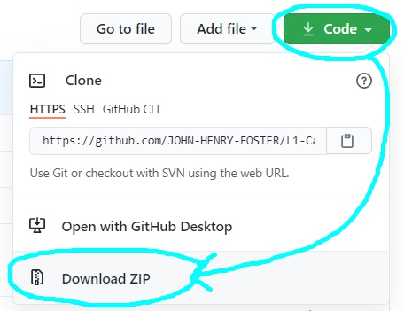

# L1-Capstone4                                                             

    

This project is a task management application for small business, that keeps a record of all users and tasks, and provides a platform for admin and other employees to assign, view, and manage tasks. It aims to simplify keeping track of who has to do what.

## How does it work?     

### All users can:
* Log into the system with a username and password.
* Assign tasks to themselves or other team members.
* View all tasks.
* View their own tasks.
* Edit tasks (change user or due date, or finalize task).

### Admin can:
* Register new users.
* View statistics.
* Generate statistical reports.

## Who can use it? 

Anyone  can use this free, open source software, although it is aimed at:
* Small to medium sized businesses that want to streamline their workflow.
* Team-working environments and large incremental projects.
* Remote-working environments where direct management isn't always possible.
* Beginner developers looking for something relatively simple to work with.
* Developers of similar systems looking for components.

We also welcome everyone who would like to continue improving this program!

## To run or edit this program:

* You need **Python**. 
* If you don't have Python, go [**here**](PYTHONINSTALL.md#installing-and-running-python).
* Else, simply click **"Code"** and **"Download ZIP"**:
  

* Run and edit the file using [**these**](PYTHONINSTALL.md#how-to-run-a-program-via-idle steps).
	  
## How you can help

* Contact us if you have any suggestions/questions.
* Write up any issues [**here**](https://github.com/JOHN-HENRY-FOSTER/L1-Capstone4/issues).
* Read our [**Contribution Guide**](CONTRIBUTING.md#contributing) which contains everything you need to know about helping to improve the project. 
* We explicity welcome non-developer input.

## Licence

This project has been licenced under [**GPLv3**](https://www.gnu.org/licenses/gpl-3.0.html).  

It is [free](https://www.gnu.org/philosophy/free-sw.html), [open source](https://opensource.org/osd), [copyleft](https://www.gnu.org/licenses/copyleft.en.html) software: 
Anyone can use, edit, and redistribute it in any way they see fit, but it must be redistributed under the same licence, and certain restrictions apply.

For more information, please see [**Licence**](LICENCE.md#licence).

## Contact us

The fastest way to get hold of us is always via [email](mailto:anoxicdrollie@gmail.com).

Shoot us a mail, and we'll get back to you as soon as time allows - we would love to hear from you!
