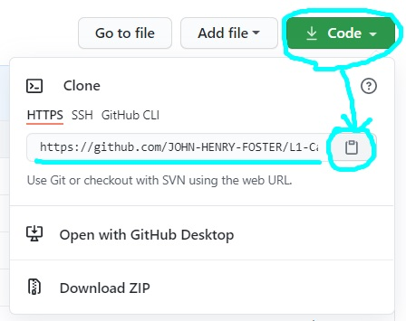
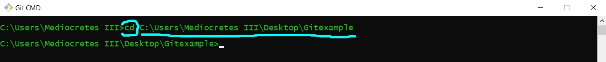

# Contributing via the fork-and-branch workflow

## Fork this repository 
* This creates a copy of this repository in your **Github** account.
* Make sure you are logged into your account.
* Find this repository.
* Click **"Fork"** in the upper right hand corner, and your'e done!


## Make a local clone
* Make sure you have [**Git**](https://docs.github.com/en/github/getting-started-with-github/quickstart/set-up-git) installed on your local machine.
* Go to your forked repository (the one you just created). 
* Click **"Code"** and under **"Clone"** select **"HTTPS"** and copy the URL:



* In **Git CMD** on your local machine, navigate to the folder where you want to clone the repository using **"cd"**:



* Then type:

```
git clone [url]
```   
* Git just copied your forked repository to your local machine.

## Add a remote repository
* Git already added a remote called origin to your local machine. 
* This allows you to push changes back to the fork on Github.
* You also have to add the original repository you forked from as a remote.
* In **Git CMD**, type:

```
git remote add
```

* The shortname can be anything you want. We used "upstream".
* The URL is the clone URL of the original repository.

## Create a new branch
* This makes changes easier to keep track of and control.
* In **Git CMD**, type:

```
git checkout -b [new branch name]
```
* This creates a new branch and checks it out (i.e. tells Git you will be making changes to it).
* You can now work on the file and save your changes.		
* Add the file if you are ready to commit by typing:

```
git add [file name]
```

* To commit the file to the new branch, type:

```
git commit -m "[descriptive message]"
```

## Push changes to Github
* You can now push your branch to your forked Github repository (i.e. "origin").
* In **Git CMD**, type:
 
```
git push origin [new branch name]
```

## Open pull request
* You can request that your change to be taken up into the main repository.
* Once you push to your forked remote, click the **"Compare & pull request"** button that appeared your forked repository:
[pic]
* Open a pull request screen should appear:
[pic]
* Write a descriptive message and click **"Create pull request"**.

## Clean up after a merge
* If your pull request is accepted you need to do some cleanup.
* First, in **Git CMD**, type:

```
git pull upstream master
```

* This syncs your local repository to the original one you forked from.
* One of the commits will be the new branch that you created, so you can safely delete the new branch on your local machine. 
* To delete the new branch, type:
 
```
git branch -d [new branch name]
```

* Next, update the master branch of your forked repo by typing:

```
git push origin master
```

* Last, push the deletion of your new branch to your forked repo:

```
git push --delete origin [new branch name]
```

And that's it for the workflow! 

You have just learned how to make changes to the repository on your local machine and submit them as a pull request.
